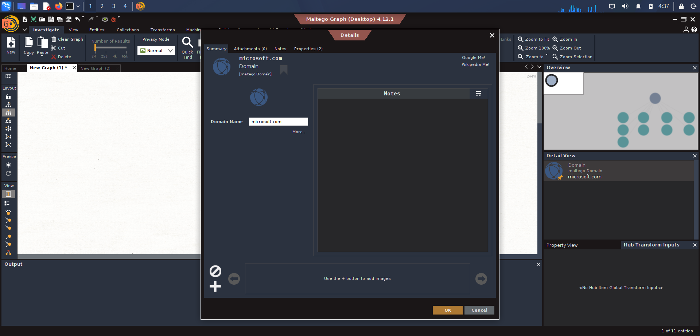
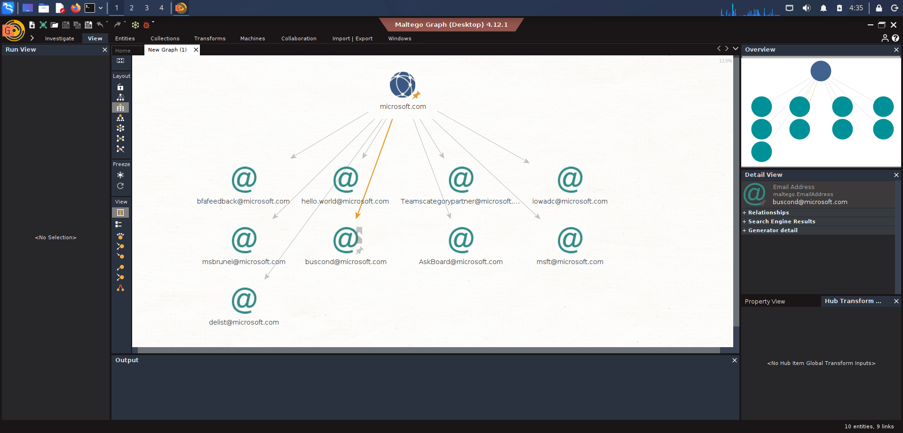
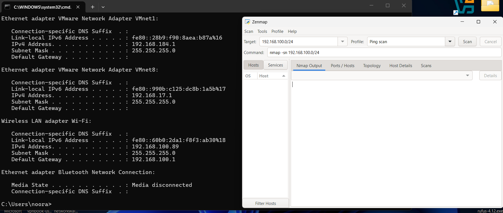

# PENETRATION TESTING REPORT
**FOOTPRINTING & NETWORK SCANNING PHASES**  
**CYBERSECURITY LAB | RECONNAISSANCE & DISCOVERY**

---

### Header Information
| Attribute | Detail |
| :--- | :--- |
| **Pentester Name** | Cybersecurity Professional |
| **Date** | 19 August 2026 |
| **Modules Completed** | Task 1: Maltego Domain Reconnaissance   Task 2: Zenmap Local Network Scanning |
| **Client / Target** | 1. `microsoft.com` (OSINT Reconnaissance)   2. Local LAN Network (`192.168.100.0/24`) |
| **Permission Secured?** | Yes |
| **Phases Covered** | Phase 1: Reconnaissance & Footprinting   Phase 2: Scanning & Network Discovery |

---

## 1. Liability Disclaimer
I have performed these activities only on the systems & devices where I had secured written permission or the devices/systems that I own myself. All these materials are for educational and research purposes only. Do not use anything from here to break the law. Every action taken is your own responsibility. Misuse can lead to criminal charges, heavy fines, loss of employment, and a permanent legal record. In most jurisdictions, unauthorized access is a crime even when no data is damaged.

---

## 2. Introduction
This report details the execution of OSINT footprinting against the `microsoft.com` domain using Maltego and local network host discovery using Zenmap. Combining these two phases demonstrates how an analyst transitions from public information gathering (OSINT) to mapping active internal network targets.

All commands and tools were executed in a controlled lab environment using Windows CMD and specialized reconnaissance software (Maltego Desktop & Zenmap). Every step below includes the exact tool/command utilized, observed output, screenshot evidence, and cybersecurity impact.

---

## 3. Tools Used

| Tool | Purpose |
| :--- | :--- |
| **Maltego Graph (Desktop v4.12.1)** | Graphical link-analysis tool used to query public records and harvest email addresses associated with `microsoft.com`. |
| **Windows CMD (`ipconfig`)** | Windows command-line utility used to determine local network interface details, subnet mask, and default gateway. |
| **Zenmap (Nmap GUI v7.98)** | Graphical frontend for Nmap used to execute Ping Scans (`-sn`) across the local subnet to discover active hosts, IP addresses, and MAC addresses. |

---

## 4. Activities Performed

### 4.1 Footprinting & Reconnaissance (Maltego)
Reconnaissance was conducted against the target domain `microsoft.com` using Maltego Graph Desktop. 

1. **Domain Target Setup:** The domain entity `microsoft.com` was added to a new Maltego graph to establish the root target for OSINT enumeration.
2. **Email Harvesting:** Applied transforms to extract publicly indexed email addresses tied to `microsoft.com`.
3. **Discovered Entities:** The transform successfully enumerated multiple email addresses linked to the target infrastructure, including:
   * `bfafeedback@microsoft.com`
   * `hello.world@microsoft.com`
   * `lowadc@microsoft.com`
   * `msbr.nei@microsoft.com`
   * `buscond@microsoft.com`
   * `AskBoard@microsoft.com`
   * `msft@microsoft.com`
   * `delist@microsoft.com`

---

### 4.2 Network Scanning with Zenmap
Network discovery was performed on the local subnet to identify active hosts, IP assignments, and physical MAC addresses.

1. **Local Subnet Identification:** Executed `ipconfig` on the Windows host machine to locate network adapter parameters:
   * **Adapter:** Wireless LAN adapter Wi-Fi
   * **IPv4 Address:** `192.168.100.89`
   * **Subnet Mask:** `255.255.255.0` (`/24`)
   * **Default Gateway:** `192.168.100.1`
2. **Subnet Ping Scan:** Inputted `192.168.100.0/24` into Zenmap using the command `nmap -sn 192.168.100.0/24`.
3. **Discovered Hosts & MAC Addresses:** The scan revealed **6 active hosts** on the subnet:

| IP Address | Host Status | MAC Address | Vendor / Host Type |
| :--- | :--- | :--- | :--- |
| `192.168.100.1` | Up | `E8:F6:54:89:C8:5E` | Huawei Technologies (Default Gateway) |
| `192.168.100.5` | Up | `78:CF:2F:11:6F:E4` | Huawei Technologies |
| `192.168.100.7` | Up | `F0:C4:2F:E0:BD:99` | Huawei Device |
| `192.168.100.8` | Up | `7C:94:2A:95:F3:8A` | Huawei Technologies |
| `192.168.100.89` | Up (Localhost) | *N/A (Self)* | Local Machine |
| `192.168.100.178` | Up | `A0:D0:5B:39:1A:38` | Samsung Electronics |

---

## 5. Risk Analysis / Impact

| # | Risk / Finding | Evidence / Observation | Potential Impact | Risk Level |
| :-: | :--- | :--- | :--- | :-: |
| **1** | Exposed Corporate Email Addresses | Maltego enumerated internal/departmental emails (`buscond@`, `delist@`, etc.) | Increased susceptibility to spear-phishing, credential harvesting, and social engineering attacks. | ● Medium |
| **2** | Visible Subnet Device Information | Zenmap identified 6 active hosts on network `192.168.100.0/24` | Unauthenticated local attackers can map network architecture and target specific endpoints. | ● Medium |
| **3** | MAC Address & Vendor Disclosure | ARP/Ping scan returned MAC hardware vendor details (Huawei, Samsung) | Allows attackers to tailor hardware-specific exploits or target known device vulnerabilities. | ● Low |

*Risk Level Key: ● Critical | ● Medium | ● Low*

---

## 6. Recommendations

* **Implement Email Obfuscation:** Reduce public exposure of corporate email addresses on public records to mitigate phishing vectors.
* **Configure Internal Network Segmentation:** Isolate critical hosts and wireless clients using VLANs to prevent unauthorized subnet mapping.
* **Deploy Network Intrusion Detection (IDS):** Monitor internal ARP traffic and ICMP sweeps for unauthorized discovery activity.
* **Maintain Rogue Device Detection:** Routinely scan subnets and compare active MAC addresses against an authorized inventory.

---

## 7. Conclusion
This lab exercise demonstrated the essential processes of OSINT footprinting and active host discovery. Using Maltego allowed for quick collection of domain-associated email addresses for threat modeling. Meanwhile, Zenmap provided a clear profile of live internal devices, IP mappings, and hardware manufacturer signatures. Proper documentation of these findings enables security teams to harden exposed assets and restrict internal visibility.

---

## 8. Evidences Collected

### Figure 8.1: Maltego Domain Configuration (`microsoft.com`)

### Figure 8.2: Maltego Email Harvesting Results

### Figure 8.3: Windows Subnet Verification (`ipconfig`)

### Figure 8.4: Zenmap Local Network Host & MAC Scan

